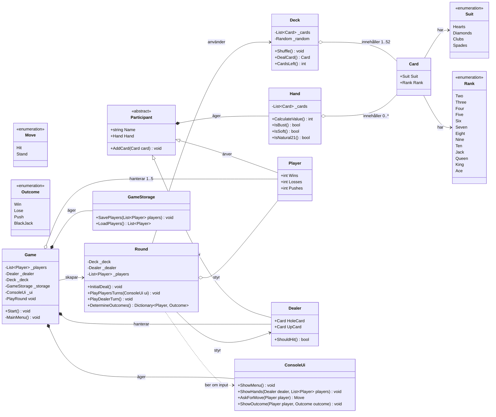

# BlackJack

```mermaid
classDiagram
    direction LR
    %% Datatyper och Enums (PascalCase)
    class Suit{
        <<enumeration>>
        Hearts
        Diamonds
        Clubs
        Spades
    }
    class Rank{
        <<enumeration>>
        Two
        Three
        Four
        Five
        Six
        Seven
        Eight
        Nine
        Ten
        Jack
        Queen
        King
        Ace
    }
    class Move{
        <<enumeration>>
        Hit
        Stand
    }
    class Outcome{
        <<enumeration>>
        Win
        Lose
        Push
        BlackJack
    }
    %%Kärnklasser
    class Card{
        +Suit Suit
        +Rank Rank
    }
    class Deck{
        -List~Card~ _cards
        -Random _random
        +Shuffle() void
        +DealCard() Card
        +CardsLeft() int
    }
    class Hand{
        -List~Card~ _cards
        +CalculateValue() int
        +IsBust() bool
        +IsSoft() bool
        +IsNatural21() bool
    }

    %% Deltagare och Arv
    class Participant {
        <<abstract>>
        +string Name
        +Hand Hand
        +AddCard(Card card) void
    }
    class Player {
        +int Wins
        +int Losses
        +int Pushes
    }
    class Dealer {
        +Card HoleCard
        +Card UpCard
        +ShouldHit() bool
    }

    %% Spelstyrning och Infrastruktur
    class Game{
        -List~Player~ _players
        -Dealer _dealer
        -Deck _deck
        -GameStorage _storage
        -ConsoleUi _ui
        +Start() void
        -MainMenu() void
        -PlayRound void
    }
    class Round {
        -Deck _deck
        -Dealer _dealer
        -List~Player~ _players
        +InitialDeal() void
        +PlayPlayersTurns(ConsoleUi ui) void
        +PlayDealerTurn() void
        +DetermineOutcomes() Dictionary~Player, Outcome~
    }
    class GameStorage {
        +SavePlayers(List~Player~ players) void
        +LoadPlayers() List~Player~
    }
    class ConsoleUi {
        +ShowMenu() void
        +ShowHands(Dealer dealer, List~Player~ players) void
        +AskForMove(Player player) Move
        +ShowOutcome(Player player, Outcome outcome) void
    }
    %% Relationer och kopplingar
    Card --> Suit : har
    Card --> Rank : har
    Deck o-- Card : innehåller 1..52
    Hand o-- Card : innehåller 0..*

    Participant <|-- Player : ärver
    Participant <|-- Dealer : ärver
    Participant *-- Hand : äger

    Game *-- GameStorage : äger
    Game *-- ConsoleUi : äger
    Game *-- Dealer : hanterar
    Game o-- Player : hanterar 1..5
    Game --> Round : skapar

    Round --> Deck : använder
    Round --> Dealer : styr
    Round o-- Player : styr
    Round ..> ConsoleUi : ber om input
```